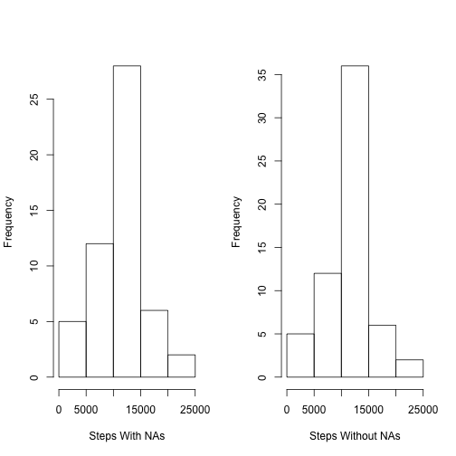
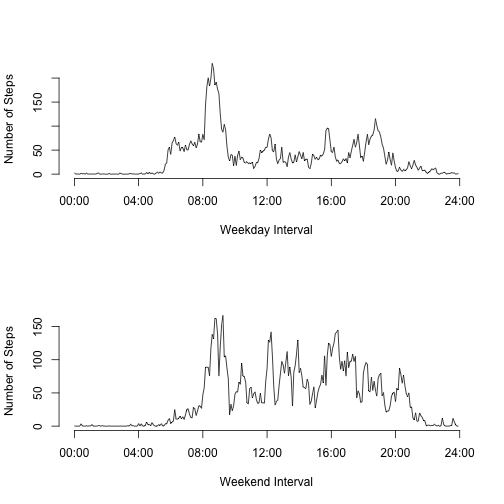

### Introduction 
This assignment makes use of data collected from monitoring devices at 5-min interval per day within two months. 
The original dataset is downloaded and unziped (url = "https://d396qusza40orc.cloudfront.net/repdata%2Fdata%2Factivity.zip"). A folder named "data" is created and contains the original csv file.

### Loading and preprocessing the data
The csv file is read and stored in a data frame. The "date" attribute is original of type "factor". NUMOFDATE is a constant indicates the number of different dates in the dataset. The "date" attribute is then converted to a "Date" type. 

```r
myData <- read.csv("./data/activity.csv")
NUMOFDATE <-  nlevels(myData$date)
myData <- transform(myData, date= as.Date(date))
```

### Mean of total number of steps taken per day
1. Sum the steps by date. The missing values are not removed. There are 61 records in total, giving one value per day. 
2. A histogram is plotted with number of steps as x-axis against frequency of occurance. 
3. Mean and median of the total number of steps taken per day are calculated and reported. Missing values are removed in calculation. 

```r
sumByDate <- aggregate(steps ~ date, data = myData, sum, na.action = na.pass)
hist(sumByDate$steps, main = "Histogram of the total number of steps taken each day", xlab = "Total Number of Steps")
```

 

```r
result <- data.frame(Mean = mean(sumByDate$steps, na.rm = T), Median = median(sumByDate$step, na.rm = T))
print(result)
```

```
##       Mean Median
## 1 10766.19  10765
```

### Average daily activity pattern
1. The column "interval" is not continuous. It is linear at each 5 to 55, but nonlinear at the jump from 55 to 100. It is necessary to convert the "interval" by time format or continous number, or 8 extra time points with the same value will be plotted (60 : 95).
2. The approach here is to add a new series of number (0:287) to represent each time interval per day
3. Plot the graph by each time interval. The x-axis is converted timestamp in "%H:%M" format. The y-axis is the averaged number of steps.
4. The interval contains the max number of steps is reported

```r
dataset <- cbind(myData, timestamp = rep(0:287, 61))
meanByInterval <- aggregate(steps ~ timestamp, data = dataset, mean)
plot(meanByInterval$timestamp, meanByInterval$steps, type = "l", main = "Average Daily Activity Pattern", xlab = "Time Interval", ylab = "Number of Steps", axes = F)
axis(2)
timeFormat <- c("00:00","04:00","08:00","12:00","16:00","20:00","24:00")
axis(1, label = timeFormat, at = seq(from = 0, to = 288, by = 48))
```

 

```r
index <- which(meanByInterval == max(meanByInterval$steps), arr.ind = T)
print(paste0("The interval contains the max number of steps is: ",dataset[index[1,1],]$interval))
```

```
## [1] "The interval contains the max number of steps is: 835"
```

### Imputing missing values
1. The total number of missing value is calculated by using complete.cases. There are total 2304 missing values in column "steps".
2. Replace NAs with mean value of the corresponding time interval. Coding includes the following steps:
  +  Add another column named "meanByInterval" indicating the mean for each interval
  +  Find out the indices of NAs in column "steps"", replace them with the mean in the same row
3. Sum the steps by date. A histogram is plotted with number of steps as x-axis against frequency of occurance. In contrast, the previous histogram with NAs is also plotted for comparison.
4. Mean and median of the total number of steps without Nas are calculated and reported. Mean and median values before imputing NAs are tabled as well for comparison.
5. The mean value is not changed after imputing the NAs. The median is slightly increased from 10765.00 to 10766.19. Imputing the mean interval has slight impact on the estimation.

```r
comp <- complete.cases(dataset)
print(paste0("Number of NAs observed: ", nrow(dataset[!comp,])))
```

```
## [1] "Number of NAs observed: 2304"
```

```r
dataset <- cbind(dataset, meanByInterval = rep(meanByInterval$steps, NUMOFDATE))
dataset[is.na(dataset$steps), 1] = dataset[is.na(dataset$steps), 5]
dataset <- dataset[,1:4]
par(mfrow = c(1,2), bg = "white")
sumByDate <- aggregate(steps ~ date, data = myData, sum, na.action = na.pass) 
hist(sumByDate$steps, main = "", xlab = "Steps With NAs")
sumByDateNoNA <- aggregate(steps ~ date, data = dataset, sum, na.action = na.pass) 
hist(sumByDateNoNA$steps, main = "", xlab = "Steps Without NAs")
```

 

```r
result <- data.frame(Mean = c(mean(sumByDate$steps, na.rm = T), mean(sumByDateNoNA$steps, na.rm = T)),  Median = c(median(sumByDate$step, na.rm = T), median(sumByDateNoNA$step, na.rm = T)))
rownames(result) <- c("withNA", "withoutNA")
print(result)
```

```
##               Mean   Median
## withNA    10766.19 10765.00
## withoutNA 10766.19 10766.19
```

### Activity patterns between weekdays and weekends
1. Create a new factor determining two levels: "weekday" and "weekend". This is achieved by taking the following steps:
  + Add a column indicating the weekday for each date
  + Create another column named "category" which is the factor deterimining the two levels: 1. weekday(Mon - Fri) 2. weekend (Sat - Sun)
2. Split the dataset according to the category, calculate the total mean for each interval
3. Plot graph for weekday and weekend. The x-axis is converted timestamp in "%H:%M" format. The y-axis is the averaged number of steps.

```r
dataset <- cbind(dataset, weekday = weekdays(dataset$date))
category <- ifelse(dataset$weekday %in% c("Saturday","Sunday"), "weekend", "weekday")
dataset <- cbind(dataset, category)
dataset <- transform(dataset, category = factor(category))
temp <- split(dataset, dataset$category)
meanWeekday <- aggregate(steps ~ timestamp, data = temp$weekday, mean)
meanWeekend <- aggregate(steps ~ timestamp, data = temp$weekend, mean)
par(mfrow = c(2,1), bg = "white")
plot(meanWeekday$timestamp, meanWeekday$steps, type = "l", main = "", 
     xlab = "Weekday Interval", ylab = "Number of Steps", axes = F)
axis(2)
axis(1, label = timeFormat, at = seq(from = 0, to = 288, by = 48))
plot(meanWeekend$timestamp, meanWeekend$steps, type = "l", main = "", 
     xlab = "Weekend Interval", ylab = "Number of Steps", axes = F)
axis(2)
axis(1, label = timeFormat, at = seq(from = 0, to = 288, by = 48))
```

 
